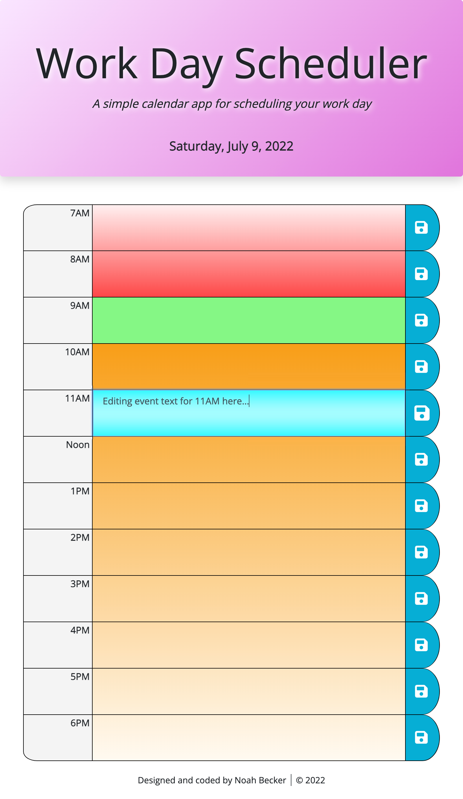
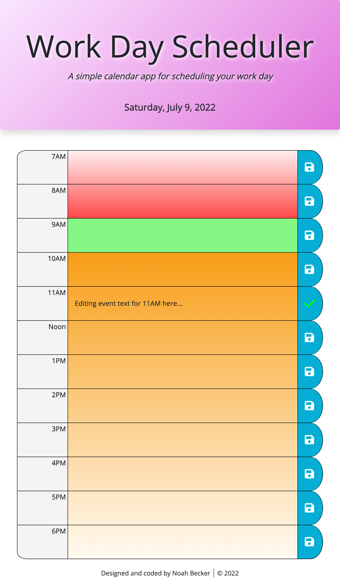

# Work Day Scheduler
## Noah Becker

### [Github repo](https://github.com/noah35becker/work-day-scheduler/)

### [Live web application](https://noah35becker.github.io/work-day-scheduler/)
 
************************************************************************

 
 

This code completes the weekly challenge for Module #5 in Columbia's Coding Bootcamp.

 

I have created a daily planner. A user can log and save events on their schedule for different hours of the day.

- Today's date appears at the top of the page
    - This date auto-refreshes at midnight if the web application is left open
    - Functionality is limited to the current date. Any events entered in the system will simply carry over to the next day.
- Event blocks appear for hours between 7AM–6PM (extended workday hours)
    - Event text descriptions can be entered or edited by clicking on any of the large boxes in the center column
        - The box changes color while being edited, and reverts to its original color when edits are complete
    - Clicking on a row's save button, or simply clicking away from an active editor, saves the given hour's event description as it currently appears
        - The save button animates in either case
        - Events are saved persistently in the browser's localStorage
    - Each row is automatically color-coded based on the current hour:
        - Past hours have a red gradient: darkest on the hour most recently passed, progressively lighter the further back in time
        - The current hour is green
        - Future hours have an orange gradient: darkest on the next hour to come, progressively lighter the further forward in time
        - Color-coding auto-refreshes at the top of each hour if the web application is left open

 

All time functionality is handled via the <b>[Luxon](https://moment.github.io/luxon/#/)</b> API.
 

The web application uses a responsive layout that adapts to different viewports and devices, coded via Bootstrap and CSS media queries.

 
************************************************************************
 
 

Below are screenshots of the web application in various states:

 
The initial state (viewed at 9:06 AM)
 
 

 

 
An event's text being edited
 
 

 

 
Right after editing an event's text (with save button animation)
 
 

 

 

– Noah